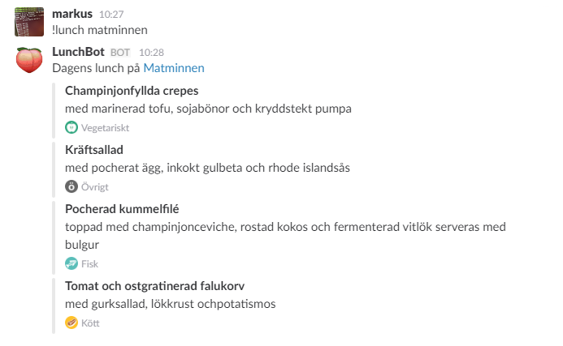
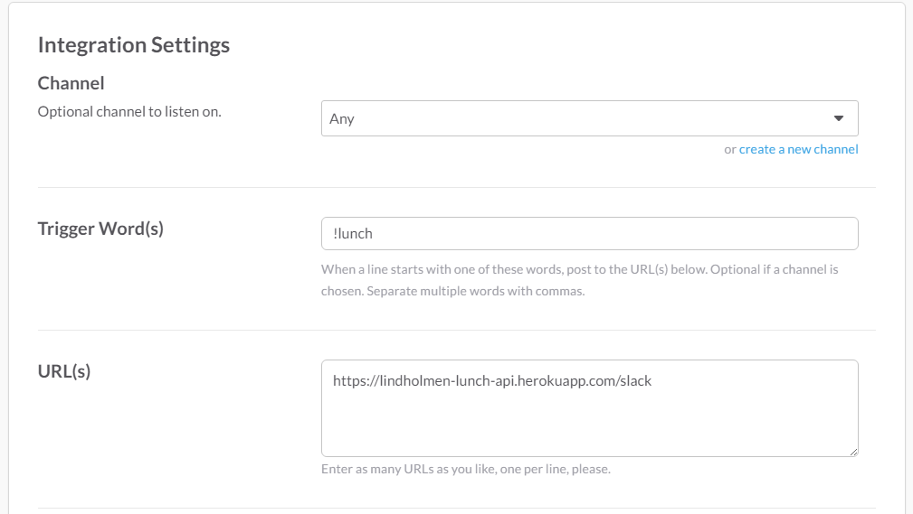

# Lindholmen Lunch API

This is a service hosted on [Heroku](https://lindholmen-lunch-api.herokuapp.com) that gives you and API to every restaurant on Lindholmen.

### Slack

Add a Outgoing Webhook that requests https://lindholmen-lunch-api.herokuapp.com/slack.  
If you want some place special you need to specify that restaurant otherwise it will be taken from the text after the trigger word(s).  

To view the list of what's available you can [go here](http://lindholmen-lunch-api.herokuapp.com/slack?restaurant=list).

Here's all the settings you need for it to work.

### Raw
Just request the raw url and you'll get everything.
